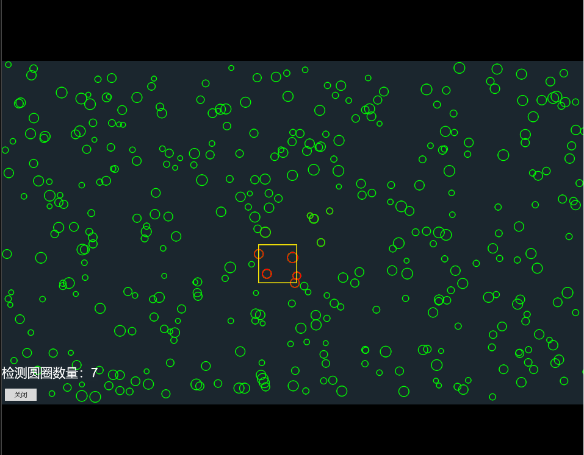
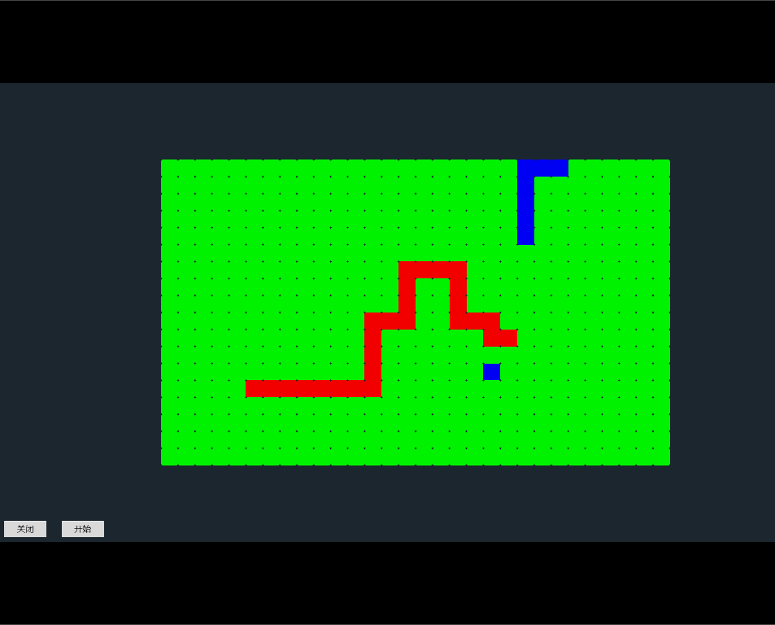
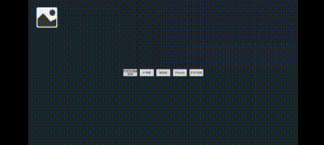

# GameAlgorithmWithCocos
## 基于cocos creator的常用游戏算法  
1. 四叉树计算碰撞检测  
当移动方框检测与哪些圆圈发送碰撞时，暴力方法便是遍历所有圆圈依次判断，数量越多效率越差。而且在移动期间需要每帧检测，全部遍历显然不行。于是便用过四叉树对圆圈进行快速查找。  

    [四叉树相关内容链接](https://zhuanlan.zhihu.com/p/530405796)  

			
    <!--块级封装-->
    
<!--将图片和文字居中-->
    
     <!--换行-->
    图1 <!--标题-->
    

  

2. A*寻路  
游戏中常用的算法便是寻路，该项目里的寻路是点击开始自动随机生成起点和终点，然后起点一步步走向终点。感兴趣的朋友也可以了解一下迪杰斯特拉算法。  
  
    [A*寻路相关内容链接](https://zhuanlan.zhihu.com/p/595716772)  

			
    <!--块级封装-->
    
<!--将图片和文字居中-->
    
     <!--换行-->
    图2 <!--标题-->
    

  

3. 酷跑小游戏  
类似天天酷派小游戏，主要做了碰撞检测以及update帧逻辑计算 (暂未上传，感兴趣的朋友可以留言)  

			
    <!--块级封装-->
    
<!--将图片和文字居中-->
    
     <!--换行-->
    酷跑小游戏效果 <!--标题-->
    

  

4. apk获取手机相册
主要涉及到原生android和coocs互相通信的内容，jsb，反射等。当前apk是基于android 13版本的，14及以上可能会出现不兼容的问题。安卓部分的代码在AppActivity.ts中

			
    <!--块级封装-->
    
<!--将图片和文字居中-->
    
     <!--换行-->
    获取本地相册图片效果 <!--标题-->
    

 

